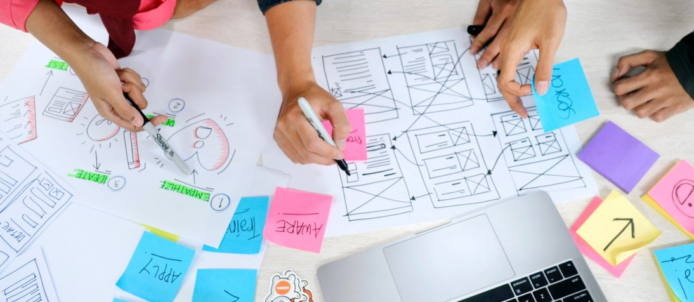

# Bandarra_Sydney_Midterm_W24
This is a GitHub Repository for MMED-1056 Web Development 1 - Midterm - Responsive Web Layout - Deliverable 2

## MMED-1055 Mulitmedia Authoring 2 - HW #2 - Assignment Brief

The midterm deliverables require you to plan and prepare wireframes and responsive boxed Web layouts to demonstrate your ability to create a wireframe and then translate it into a responsive grid layout.

Each student is required to complete these midterm steps individually. The wireframes should be for a Web site of your own design (not your FIP as those wireframes are done in your design classes), and then you are required to create a boxed responsive layout (no specific content)

You can use the boxed layout you create for this midterm for your FIP if you wish, or you can create a new boxed layout.

You will have time in class over 2 weeks to work on the different deliverables/stages, which are as follows:

**Step 1:** Wireframes for 2 HTML pages
Submit WIP wireframes, PDF only (5%)

**Step 2:** Boxed responsive layout for 1 page (index.html)
Completed wireframes from Step 1, and boxed-out HTML page (15%)

## Installation
No installation required
## Usage
Practice fair use. Start with the README.md file, then view [index.html](index.html)

**How to Use the Index Page:**
1. View the Index
2. Expand and shrink the browser window to observe the responsive layout.

### History
Version history is documented through GitHub best practices.
### Contributing
**Syd (Sydney) Bandarra** (they/them)

Student at Fanshawe College, Interactive Media Design, IDP, Fall 2023

Faculty of Creative Industries,

School of Digital and Performing Arts

137 Dundas Street, London, ON N6A 1E9

Student #: 1204224

s_bandarra@fanshaweonline.ca

www.fanshawec.ca 

### Land Acknowledgement 
London, Ontario is located on the traditional lands of the Anishinaabek, Haudenosaunee, Lūnaapéewak and Attawandaron peoples. This land continues to be home to diverse Indigenous peoples, whom we recognize as contemporary stewards of the land, vital contributors of our society, and deserving of sovereignty and reconciliation.
